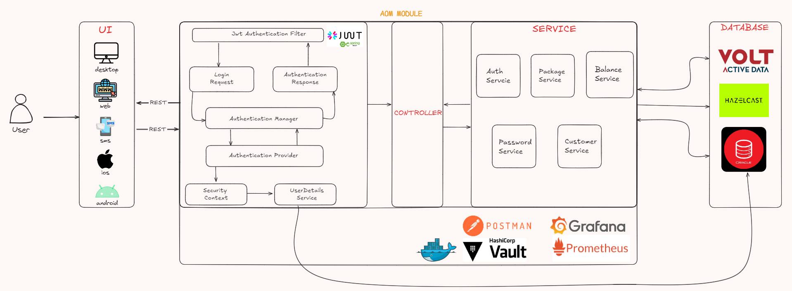

# AOM (Account Order Management) Service

> AOM is a module that is responsible for managing the account orders.
> It is a microservice that is part of the larger system that is responsible for managing the orders of the accounts.
> It is a RESTful service that is built using Spring Boot and Java. 
---
## High Level Design


---
## How the AOM Service Works
* Firstly, the requests are sent to the AOM security layer. 
The security layer checks the token and the role of the user. 
If the token is valid and the user has the required role, the request is sent to the AOM controller. 
* The controller then sends the request to the AOM service. 
* The service then sends the request to the AOM repository according to the request type.
* The repository then sends the request to the Oracle DB to create a customer account, create a balance for a customer account, 
login a customer account, fetch customer account details and reset customer password or to the VoltDB to fetch the customer account details,
* Then, the repository sends the response back to the service. 
* The service then sends the response back to the controller. 
* The controller then sends the response back to the security layer. The security layer then sends the response back to the user.

---

## Features
- Create a customer account
- Login a customer account
- Create balance for a customer account
- Fetch customer account details
- Fetch customer account balance
- Reset customer password
---
## Interactions
- With UI Applications: 
    - AOM accepts requests from the 5 different UI applications including the web, android, ios, desktop and sms applications.
    - These requests include creating a customer account, creating a balance for a customer account, fetching customer account details, 
    - fetching customer account balance and resetting customer password.
- With VoltDB:
    - AOM interacts with the VoltDB to receive the customer account details, usage details, and remaining balance details.
- With Oracle DB:
    - AOM interacts with the Oracle DB to create a customer account, create a balance for a customer account,
   login a customer account, fetch customer account details and reset customer password.
- With Hazelcast:
    - AOM interacts with the Hazelcast to send the customer MSISDN number to be processes by TGF during the account creation process.
- With Notification Service:
    - AOM interacts with the Notification Service to send the new customer password when customer forgets the password.
---
## Technologies
- Java
- Spring Boot
- Spring Security
- JWT
- OpenAPI
- Docker
- Maven
- Oracle DB
- VoltDB
- Hazelcast
- Prometheus
- Grafana

---

## How to Run
- Clone the repository using the following command:

``` git clone https://github.com/kaanyvz/Evren-Cell.git ```

- For the Oracle DB, VoltDB and Hazelcast you need to find the docker images and run them.
- For the Oracle DB, you need to create a table for the customer account and balance and stored procedures for the CRUD operations.
- For the VoltDB, you need to create a table for the customer account details and stored procedures for the CRUD operations.
- For prometheus, grafana and vault you need to run the docker images.
- Before running the spring boot application, make sure that the Oracle DB, VoltDB, Hazelcast, Prometheus, Grafana and Vault containers are up and running.
- Then, you need to run the AOM spring boot application.

---
## Endpoints
<table style="width:100%">
  <tr>
    <th>Method</th>
    <th>Endpoint</th>
    <th>Description</th>
    <th>Request Details</th>
    <th>Role</th>
  </tr>

  <tr>
      <td>POST</td>
      <td>/v1/api/forgetPassword/reset</td>
      <td>Reset the password of a customer account.</td>
      <td><a href="#reset">Request Details</a></td>
      <td>Public</td>
  </tr>

  <tr>
      <td>POST</td>
      <td>/v1/api/auth/register</td>
      <td>Create a customer account.</td>
      <td><a href="#register">Request Details</a></td>
      <td>Public</td>
  </tr>

  <tr>
      <td>POST</td>
      <td>/v1/api/auth/login</td>
      <td>Login a customer account.</td>
      <td><a href="#login">Request Details</a></td>
      <td>Public</td>
  </tr>

  <tr>
      <td>GET</td>
      <td>/v1/api/packages/getUserPackageByMsisdn</td>
      <td>Fetch customer account details by customer's msisdn.</td>
      <td><a href="#getCustomerByMsisdn">Request Details</a></td>
      <td>USER, ADMIN</td>
  </tr>

  <tr>
      <td>GET</td>
      <td>/v1/api/packages/getPackageDetails</td>
      <td>Fetch package details by package name.</td>
      <td><a href="#getPackageDetails">Request Details</a></td>
      <td>USER, ADMIN</td>
  </tr>

  <tr>
      <td>GET</td>
      <td>/v1/api/packages/getAllPackages</td>
      <td>Fetch all packages.</td>
      <td><a href="#getAllPackages">Request Details</a></td>
      <td>USER, ADMIN</td>
  </tr>

  <tr>
      <td>GET</td>
      <td>/v1/api/customer/getCustomerByMsisdn</td>
      <td>Fetch customer account details by customer's msisdn.</td>
      <td><a href="#getCustomerByMsisdn">Request Details</a></td>
      <td>USER, ADMIN</td>
  </tr>

  <tr>
      <td>GET</td>
      <td>/v1/api/customer/getAllCustomers</td>
      <td>Fetch all customer accounts.</td>
      <td><a href="#getAllCustomers">Request Details</a></td>
      <td>ADMIN</td>
  </tr>

  <tr>
      <td>GET</td>
      <td>/v1/api/balance/remainingBalance</td>
      <td>Fetch remaining balance of a customer account.</td>
      <td><a href="#remainingBalance">Request Details</a></td>
      <td>USER, ADMIN</td>
  </tr>

</table>

---

## Valid Request Examples

#### <a id="reset"> Reset Password For User
```
  v1/api/forgetPassword/reset
{
    "email": "string",
    "TCNumber": "stringstrin"
}
```

#### <a id="register"> Register For User
```
  v1/api/auth/register
{
    "name": "string",
    "surname": "string",
    "msisdn": "stringstring",
    "email": "string",
    "password": "string",
    "TCNumber": "stringstrin",
    "packageName": "string"
}
```

#### <a id="login"> Login For User
```
  v1/api/auth/login
{
    "msisdn": "stringstring",
    "password": "string"
}
```

#### <a id="getCustomerByMsisdn"> Get Customer By Msisdn
```
  v1/api/packages/getUserPackageByMsisdn?msisdn={string}
  Bearer Token Role: USER, ADMIN
```

#### <a id="getPackageDetails"> Get Package Details
```
  v1/api/packages/getPackageDetails?packageName={string}
  Bearer Token Role: USER, ADMIN
```

#### <a id="getAllPackages"> Get All Packages
```
  v1/api/packages/getAllPackages
  Bearer Token Role: USER, ADMIN
```

#### <a id="getCustomerByMsisdn"> Get Customer By Msisdn
```
  v1/api/customer/getCustomerByMsisdn?msisdn={string}
  Bearer Token Role: USER, ADMIN
```

#### <a id="getAllCustomers"> Get All Customers
```
  v1/api/customer/getAllCustomers
  Bearer Token Role: ADMIN
```

#### <a id="remainingBalance"> Get Remaining Balance
```
  v1/api/balance/remainingBalance?msisdn={string}
  Bearer Token Role: USER, ADMIN
```
---

